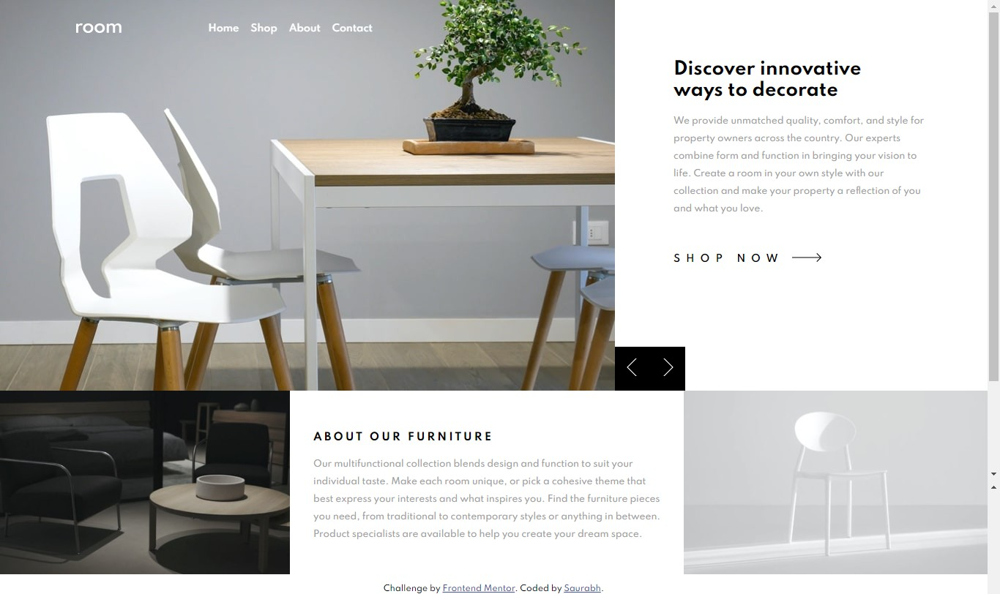

# Frontend Mentor - Room homepage solution

This is a solution to the [Room homepage challenge on Frontend Mentor](https://www.frontendmentor.io/challenges/room-homepage-BtdBY_ENq). Frontend Mentor challenges help you improve your coding skills by building realistic projects. 

## Table of contents

- [Overview](#overview)
  - [The challenge](#the-challenge)
  - [Screenshot](#screenshot)
  - [Links](#links)
- [My process](#my-process)
  - [Built with](#built-with)
  - [What I learned](#what-i-learned)
  - [Useful resources](#useful-resources)
- [Author](#author)

## Overview

### The challenge

Users will be able to:

- View the optimal layout for the site depending on their device's screen size
- See hover states for all interactive elements on the page
- Navigate the slider using their mouse/trackpad.

### Screenshot




### Links
- Live Site URL: [Add live site URL here](https://your-live-site-url.com)

## My process

### Built with

- Semantic HTML5 markup
- CSS custom properties
- Flexbox
- CSS Grid
- Mobile-first workflow
- SASS

### What I learned

This has been quiet challenging relying myself on all the fratures within the mockup. It feels so satisying that I was able to make it through and it really looks as close to the design. I'd be working even harder in minimizing the amount of time that I've been taking to complete each tasks. 

It was really fun coding the carousel section in JavaScript.

```js
// carousel
var slideIndex = 1;
showSlides(slideIndex);

function plusSlides(n) {
  showSlides((slideIndex += n));
}

function showSlides(n) {
  var i;
  var slides = document.querySelectorAll(".slide");


  if (n > slides.length) {
    slideIndex = 1;
  }
  if (n < 1) {
    slideIndex = slides.length;
  }
  for (i = 0; i < slides.length; i++) {
    slides[i].style.display = "none";
  }
  
  function screenFunction(x) {
    if (x.matches) { // If media query matches
      slides[slideIndex - 1].style.display = "flex";


    } else {
      slides[slideIndex - 1].style.display = "block";

    }
  }

  var x = window.matchMedia("(min-width: 1024px)")
  screenFunction(x)
  x.addListener(screenFunction) // Attach listener function on state changesonsole

```


### Useful resources

- [Carousel section](https://www.w3schools.com/howto/howto_js_slideshow.asp) - This helped me with the carousel. I really liked this and will use it going forward.

## Author

- Frontend Mentor - [@saurabh1996-rex
](https://www.frontendmentor.io/profile/saurabh1996-rex)

